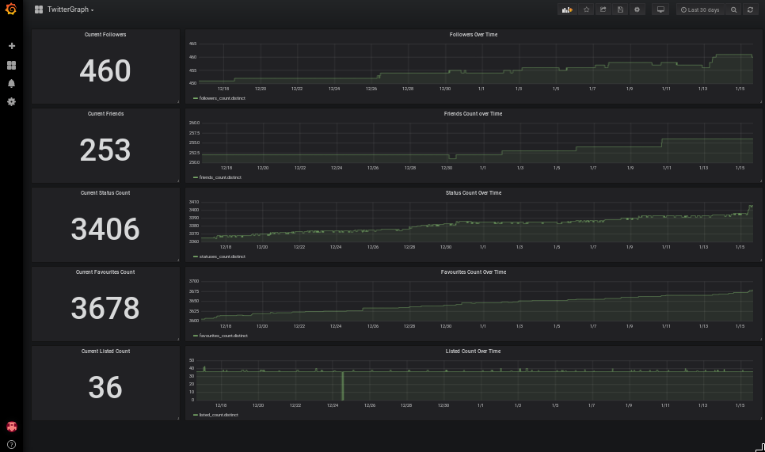

# Monitor Your Twitter Stats with a Python script, InfluxDB and Grafana running WITHOUT a container




## Requirements

*   A Twitter account to Monitor
*   A Twitter Developer API Account for gathering stats

## What you'll learn

The included files can serve as an introduction to [Tweepy](http://www.tweepy.org/), an "easy-to-use Python module for accessing the Twitter API", InfluxDB configuration,  and automated Grafana [Dashboard Providers](http://docs.grafana.org/v5.0/administration/provisioning/#dashboards).


## Architecture

This app consists of a Python script which polls the Twitter Developer API on a schedule for stats about your Twitter account, and stores them in InfluxDB as time series data.  Grafana is displays the data in human-friendly formats (counts and graphs) on customizable dashboards.

## Prerequisite: Get a Twitter Developer API Account

Follow the [Twitter instructions to sign up for a Developer account](https://developer.twitter.com/en/apply/user), allowing access to the Twitter API.  Record your `API_KEY`, `API_SECRET`, `ACCESS_TOKEN` and `ACCESS_SECRET` to use later.


## Prerequisite: Clone the TwitterGraph Repo

The [TwitterGraph Github Repo](https://github.com/clcollins/twitterGraph/) contains all the files needed for this project, as well as a few to make life easier if you wanted to do it all over again.


## Setup InfluxDB

[InfluxDB](https://www.influxdata.com/time-series-platform/influxdb/) is an opensource data store designed specifically for time series data.  Since this project will be polling Twitter on a schedule using a CronJob, InfluxDB is perfect for holding storing the data.


## Setup Grafana

 [Grafana](https://grafana.com/).  Grafana is an open source project for visualizing time series data (thing: pretty, pretty graphs).


### Create a Secret for the Twitter API credentials

The cron job uses your Twitter API credentials to connect to the API and pull the stats, pulling them from environment variables inside the container.  Create a secret to store the Twitter API credentials and the name of the account to gather the stats from, substituting your own credentials and account name:

```
UPDATE ME LATER?
```

### Create a Cron Job

To be written for a Raspberry Pi w/o running containers (crontab)

## Success!

That should be it!  If you've followed all the steps correctly, thought the steps are totally incomplete, you will be left with an InfluxDB database, a Cron Job collecting stats from your Twitter account, and a Grafana deployment to view the data.  

## Where to go from here

The data collected by the TwitterGraph script is relatively simplistic.  The stats that are colleced are described in the ["data_points" dictionary in the app.py script](https://github.com/clcollins/twitterGraph/blob/master/app.py#L103-L109), but there's [a ton of data available](https://tweepy.readthedocs.io/en/v3.5.0/api.html#tweepy-api-twitter-api-wrapper).  Adding a new Cron Job that runs daily to collect the day's activity (number of post, number of follows, etc.) would be a natural extension of the data.

More interesting, probably, would be the collection of the daily data correllated together:  how many followers were gained or lost based on the number of posts that day, etc.
